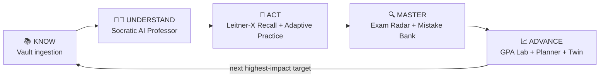

<div align="center">

# ⚡ KYNEX — The Academic Intelligence OS

**AI Professor · Leitner-X Recall · Exam Radar · GPA Lab — one zero-trust Academic Operating System.**

*Built for the IBM Bob 2.0 Hackathon (September 2026)*

`325+ automated tests passing` · `Zero-Trust security` · `10 languages + native RTL` · `MIT License`

</div>

> 🔗 **Live demo:** `_add your deployment URL here before publishing_`
>
> 📸 **Screenshots:** [`docs/screenshots/`](./docs/screenshots) — dashboard, grounded AI Professor, Recall, Examiner & GPA Lab (light + dark + RTL Arabic).
>
> 🎤 **Judging materials:** [Pitch deck script](./docs/PITCH_DECK.md) · [2-minute video script](./docs/VIDEO_SCRIPT.md) · [Code review report](./docs/CODE_REVIEW_REPORT.md)

---

## ❗ The Problem

Students juggle six disconnected tools — a PDF reader here, a flashcard app there, a generic AI chatbot that confidently invents facts, and a GPA spreadsheet. None of them talk to each other, none of them know what the student actually practiced, and every one of them answers the same useless question: *"what should I study?"* — with either silence or a generic syllabus. The result: effort without direction, and AI that hallucinates instead of teaching.

## 💡 What Makes KYNEX Different

- **One evidence loop, not six apps.** Every module writes back to a single mastery model — what you practiced yesterday literally decides what KYNEX serves you tomorrow (KNOW → UNDERSTAND → ACT → MASTER → ADVANCE).
- **Deterministic intelligence, not vibes.** Gap radar, confidence calibration, memory decay and exam readiness are computed from real practice evidence with transparent math — the AI layer anchors to your own Vault material and is fenced by a deterministic out-of-scope gate *before* the model is ever called. When evidence doesn't exist, KYNEX says so instead of inventing it.
- **Zero-trust from row zero.** Identity is resolved server-side on every call, every row is re-verified against the caller, and an adversarial cross-tenant test suite tries to break it continuously.

## 🧠 Architecture Flow — the KYNEX Cognitive Loop

Every module feeds the next. Evidence from studying yesterday decides what KYNEX serves tomorrow.



| Stage | Module | What it guarantees |
|---|---|---|
| **KNOW** | Vault (`/library` · `/add`) | PDF/URL/YouTube/text → structured concepts. NFKC-sanitized, SSRF-guarded, honest failure states — nothing faked. |
| **UNDERSTAND** | Socratic AI Professor (`/chat`) | Answers anchored to the student's own Vault chunks (untrusted-content framing + deterministic out-of-scope gate before the model is ever called). |
| **ACT** | Leitner-X Recall (`/flashcards`) + Practice (`/practice`) | Atomic server-side interval math; adaptive difficulty from real mastery evidence. |
| **MASTER** | Exam Radar (`/examiner`) + Mistake Bank (`/mistakes`) | Root-cause autopsies (conceptual vs. careless vs. time-pressure) resolved only by later evidence. |
| **ADVANCE** | GPA Lab (`/gpa`) + Planner + Twin (`/twin`) | Credit-weighted projections, required-GPA feasibility math, NEXT MOVE missions. |

---

## 🛠️ Core Modules

1. **The Socratic AI Professor (`/chat`):** Grounded tutoring engine — every conversation is anchored to the student's own Vault material and mastery data. Teaching modes span STARTER explanations to EXAM drills, with Socratic and Feynman loops that withhold answers until the student commits to an attempt.
2. **The Leitner-X Spaced Repetition Engine (`/flashcards`):** Mathematical scheduler with per-card ease, interval and lapse tracking; confidence-calibrated retrieval surfaces exactly what is due, server-computed.
3. **The Exam Radar & Triage Matrix (`/insights` · `/examiner`):** Preparation priority triaged from real evidence — accuracy, recency and uploaded materials. It never claims a topic will appear, and written-answer marks are provisional rubric marks.
4. **The Mistake Bank & Autopsy (`/mistakes`):** Every miss is classified — conceptual, calculation, careless, misreading, time-pressure — and tracked until later evidence resolves it.

Supporting modules: **KYNEX Twin**, **Vault**, **KYNEX Move** missions, **GPA Lab**, **Planner**, **KYNEX Map** (`/graph`), **Visualize**, **Writer**.

---

## 🌍 Global & Generational Ecosystem
- **10 Languages, Native RTL:** English, Mandarin (Simplified), Hindi, Spanish, French, Arabic, Bengali, Portuguese, Indonesian and Urdu — structural RTL mirroring (`dir` attributes, logical `ms-*`/`me-*` spacing) plus dedicated Naskh/Nastaliq/Devanagari/Bengali typography.
- **Generational Style Matrix:** Five runtime UI profiles (Glassmorphism, Neumorphism, Claymorphism, Bento, Minimal) × four generational personas (Classic, Millennial, Gen Z, Gen Alpha) — instant switching from ⌘K, persisted via versioned storage with corruption-sweep protection.
- **Study Buddy Companion:** A fully local, customizable cartoon assistant — Cyber-Bot, Wise Owl, Pixel Scholar or Anime Mentor, rename it anything, with context-aware module guidance in your persona's tone. Zero AI calls; zero data leaves the browser.

---

## 🛡️ Zero-Trust Security — built in, not bolted on

- **IDOR & Tenant Isolation:** Every query and mutation resolves identity **server-side only** and re-verifies row ownership (`row.userId === caller`) before read or write — a caller can never pass another user's id anywhere. Verified continuously by an adversarial test suite (`crossUserAttacks.test.ts`, 16 tests) that attempts cross-tenant reads, writes and deletes.
- **AI Perturbation Shield:** NFKC normalization, bidi-control removal, zero-width character stripping and frame-marker neutralization on all uploaded material — before it reaches the database or an AI prompt boundary.
- **Fail-Closed Quotas & Entitlements:** Server-authoritative daily AI limits and plans; the client never sends or caches entitlement state.
- **Three-State Circuit Breakers:** `closed → open → half_open` on every upstream AI call, with graceful local fallbacks — the UI never white-screens.
- **SSRF-Guarded Ingestion:** Redirect-per-hop URL re-validation, private-address blocking, bounded exponential backoff with `Retry-After` and user-agent rotation.
- **Deletion Integrity:** Account and material deletes cascade atomically — zero orphaned records (`deletionIntegrity.test.ts`).

---

## 🧪 Verification — 325 automated tests, 33 suites

```bash
bun tsc -b --noEmit   # strict typecheck: zero errors
bun run test          # 325 tests / 33 files — all green
bun convex dev --once # backend schema sync
```

Adversarial suites included: cross-user attacks, AI context isolation, perturbation shield E2E, deletion integrity, chaos boundaries (crash + circuit-breaker handoff), referral exploits, router-context isolation, and the core validation suite (GPA boundaries, sanitization shield, rate-limit classification).

## 🚀 Getting Started

```bash
bun install
cp env.example .env   # fill real values; .env is git-ignored (or use the platform Keys UI)
bun run dev
```

> 🔐 **Secrets hygiene:** real keys live only in `.env` (strictly git-ignored) or the platform's encrypted key store. [`env.example`](./env.example) documents every variable with placeholders — no secret is ever committed. See [`SECURITY.md`](./SECURITY.md).
>
> 📄 Released under the [MIT License](./LICENSE).
>
> 📂 *Enterprise development workflow and session logs: [`bob_sessions/`](./bob_sessions).*

---

<div align="center"><em>KNOW → UNDERSTAND → ACT → MASTER → ADVANCE</em></div>
